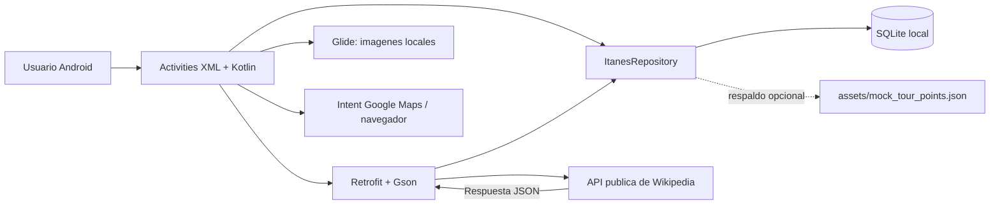
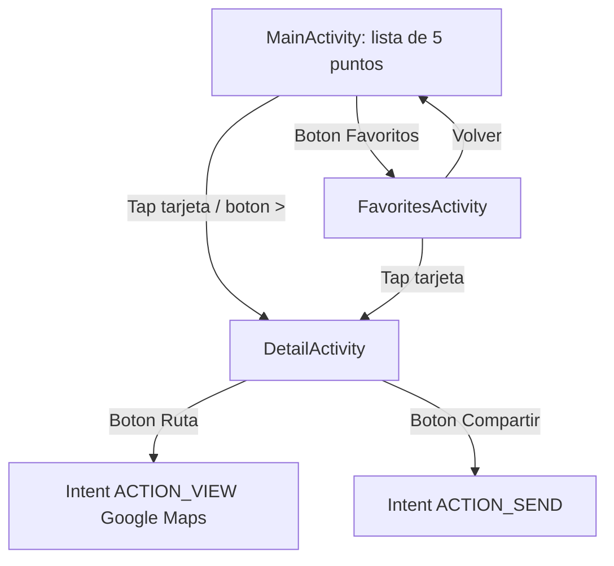

# Caso practico: ITANES Tour

## 1. Resumen de la solucion

ITANES Tour es una aplicacion Android nativa para visualizar un recorrido turistico de 5 puntos en la ruta "Cusco y Valle Sagrado". La app funciona offline porque guarda la informacion principal en SQLite y usa imagenes locales. Cuando hay conexion, consulta la API publica de Wikipedia, actualiza descripciones y coordenadas, y permite abrir rutas en auto mediante Google Maps.

## 2. Arquitectura general



Capas principales:

- **Frontend Android:** `MainActivity`, `DetailActivity`, `FavoritesActivity`, layouts XML y Material Components.
- **Datos locales:** `ItanesDatabaseHelper` con tablas `tour_points` y `favorites`.
- **API / JSON:** Retrofit consulta `es.wikipedia.org/w/api.php`, Gson procesa la respuesta y el repositorio guarda los cambios en SQLite.
- **Mock local:** `mock_tour_points.json` se conserva como evidencia y respaldo para pruebas sin servidor.
- **Servicios externos:** Google Maps se abre con un Intent usando `travelmode=driving`.

## 3. Wireframes de interfaces

### Pantalla principal: `MainActivity`

```text
+------------------------------------+
| ITANES Tour                         |
| Ruta Cusco y Valle Sagrado          |
| [Favoritos] [Actualizar]            |
+------------------------------------+
| Estado conexion / offline           |
| 5 puntos disponibles offline        |
|                                    |
| [Foto] Plaza de Armas               |
| Ciudad + descripcion                |
| [Guardar] [Ruta] [>]                |
|                                    |
| [Foto] Qorikancha                   |
| [Guardar] [Ruta] [>]                |
+------------------------------------+
```

### Pantalla detalle: `DetailActivity`

```text
+------------------------------------+
| [<] Punto 2 de 5                    |
+------------------------------------+
| Foto grande del lugar               |
+------------------------------------+
| Nombre del punto                    |
| Ciudad                              |
| Descripcion                         |
| Direccion / horario / ingreso       |
| Recomendacion                       |
| [Ruta]                              |
| [Guardar / Guardado]                |
| [Compartir]                         |
+------------------------------------+
```

### Pantalla favoritos: `FavoritesActivity`

```text
+------------------------------------+
| [<] Favoritos                       |
+------------------------------------+
| Si no hay favoritos: mensaje vacio  |
| Si hay favoritos: mismas tarjetas   |
| con opcion de quitar favorito       |
+------------------------------------+
```

## 4. Estructura de base de datos SQLite

### Tabla `tour_points`

| Campo | Tipo | Descripcion |
|---|---:|---|
| `id` | TEXT PK | Identificador unico del punto turistico |
| `route_order` | INTEGER | Orden dentro del recorrido |
| `name` | TEXT | Nombre del lugar |
| `city` | TEXT | Ciudad o zona |
| `description` | TEXT | Informacion basica del lugar |
| `address` | TEXT | Direccion referencial |
| `latitude` / `longitude` | REAL | Coordenadas para ruta en Maps |
| `image_name` | TEXT | Nombre del recurso drawable local |
| `estimated_drive` | TEXT | Tiempo sugerido en auto |
| `schedule` | TEXT | Horario |
| `price` | TEXT | Costo referencial |
| `tips` | TEXT | Recomendacion para el viajero |
| `updated_at` | TEXT | Fecha de actualizacion |

### Tabla `favorites`

| Campo | Tipo | Descripcion |
|---|---:|---|
| `point_id` | TEXT PK/FK | Punto turistico guardado |
| `created_at` | INTEGER | Fecha local de guardado |

Relacion: `favorites.point_id` referencia `tour_points.id`.

## 5. Ejemplo de API REST y procesamiento JSON

Endpoint real utilizado:

```text
GET https://es.wikipedia.org/w/api.php
    ?action=query
    &format=json
    &formatversion=2
    &redirects=1
    &prop=extracts|pageimages|coordinates
    &exintro=1
    &explaintext=1
    &exsentences=3
    &piprop=thumbnail
    &pithumbsize=800
    &titles=Plaza de Armas del Cuzco|Coricancha|Sacsayhuaman|P%C3%ADsac (sitio arqueol%C3%B3gico)|Ollantaytambo
```

Ejemplo abreviado de la respuesta JSON:

```json
{
  "query": {
    "pages": [{
      "title": "Coricancha",
      "extract": "El Coricancha o Qorikancha fue el templo mas importante...",
      "coordinates": [{ "lat": -13.520111, "lon": -71.975722 }],
      "thumbnail": { "source": "https://...", "width": 800, "height": 600 }
    }]
  }
}
```

Procesamiento implementado:

```kotlin
WikipediaApiClient.api.getTouristPages(/* parametros */)
    .enqueue(object : Callback<WikipediaResponse> {
        override fun onResponse(call: Call<WikipediaResponse>, response: Response<WikipediaResponse>) {
            val pages = response.body()?.query?.pages.orEmpty()
            repository.refreshFromWikipedia(pages)
        }
    })
```

`WikipediaTourPointMapper` relaciona cada articulo con su punto ITANES. Se actualizan la descripcion y las coordenadas; las fotos auditadas, horarios, precios, recomendaciones y favoritos permanecen locales. Si la red o la API fallan, SQLite conserva la ultima informacion disponible.

El archivo `app/src/main/assets/mock_tour_points.json` y `TourPointJsonParser` se mantienen como simulacion opcional solicitada por el caso practico. La implementacion principal ya usa datos reales de internet. La consulta sigue el modelo `action=query` y las propiedades `extracts`, `pageimages` y `coordinates` documentadas por [MediaWiki](https://www.mediawiki.org/wiki/API:Query).

## 6. Flujo de navegacion con Activities e Intents



## 7. Herramientas y librerias

- **Lenguaje:** Kotlin.
- **IDE:** Android Studio.
- **UI:** XML layouts, Material Components, AppCompat.
- **Imagenes:** Glide (`com.github.bumptech.glide:glide`) para cargar recursos locales.
- **API REST:** Retrofit + Gson conectados a la API publica de Wikipedia.
- **Base de datos:** SQLite mediante `SQLiteOpenHelper`.
- **Mapas:** Intent con URL de Google Maps Directions. El primer tramo parte del Aeropuerto Alejandro Velasco Astete y los siguientes parten del punto anterior.
- **Compatibilidad:** minSdk 26, Android 8.0+.

## 8. Diseno responsive

- Los layouts usan `match_parent`, `LinearLayout`, `NestedScrollView` y tarjetas fluidas.
- Se agrego `values-sw600dp/dimens.xml` para tablets, aumentando padding y alto de imagenes.
- El contenido se desplaza verticalmente para evitar cortes en pantallas pequenas.

## 9. Cronograma tentativo

| Dia | Actividad |
|---:|---|
| 1 | Analisis del caso, alcance, puntos turisticos y estructura de datos |
| 2 | Diseno de wireframes, navegacion y arquitectura |
| 3 | Implementacion de SQLite, modelo y datos semilla |
| 4 | Implementacion de pantalla principal y tarjetas |
| 5 | Pantalla detalle, favoritos y persistencia |
| 6 | Integracion de rutas Maps, compartir y Glide |
| 7 | Integracion API Wikipedia, mock JSON, pruebas offline y ajustes responsive |
| 8 | Generacion APK, documentacion y evidencias |

## 10. Requerimientos tecnicos

- Android 8.0 Oreo o superior.
- Sin conexion: consulta de recorrido, textos, imagenes locales y favoritos.
- Con conexion: actualizacion real desde Wikipedia, rutas en Google Maps/navegador y compartir.
- Memoria recomendada: 2 GB RAM o superior.
- Almacenamiento: menos de 50 MB para app base y datos locales.

## 11. Evidencias y rutas del proyecto

- Codigo principal: `app/src/main/java/com/example/entregable1dam/`.
- Layouts: `app/src/main/res/layout/`.
- Fotografias reales locales: `app/src/main/res/drawable/photo_*.jpg`.
- Cliente API real: `app/src/main/java/com/example/entregable1dam/network/`.
- Mock JSON opcional: `app/src/main/assets/mock_tour_points.json`.
- APK debug firmado para pruebas: `app/build/outputs/apk/debug/app-debug.apk`.
- Capturas reales del celular: `C:/Users/User/Documents/senati/evidencias_itanes/`.

## 12. Pruebas locales realizadas

| Prueba | Resultado esperado | Estado |
|---|---|---|
| Compilar APK debug | Build successful | Correcto, verificado con `:app:assembleDebug` |
| Ejecutar pruebas unitarias | Build successful | Correcto, verificado con `:app:testDebugUnitTest` |
| Abrir app sin internet | Muestra los 5 puntos desde SQLite | Preparado en codigo |
| Guardar favorito | Cambia boton a "Guardado" y persiste en `favorites` | Preparado en codigo |
| Ver favoritos | Lista solo puntos guardados | Preparado en codigo |
| Abrir ruta | Lanza Google Maps o navegador con modo auto | Preparado en codigo |
| Consultar API real | Wikipedia devuelve los 5 articulos con extractos y coordenadas | Correcto, verificado contra el endpoint |
| Actualizar con conexion | Retrofit procesa JSON y persiste cambios en SQLite | Correcto, implementado y compilado |
| Fallo de red/API | Conserva la ultima informacion local | Correcto, manejado en callback de error |

Las pantallas fueron verificadas en el dispositivo Android fisico `2412DPC0AG`. Se capturaron la pantalla principal, las cinco fichas, acciones, favoritos, creditos y dos rutas reales en Google Maps.

Comandos utiles:

```powershell
.\gradlew.bat :app:assembleDebug
.\gradlew.bat :app:testDebugUnitTest
```

## 13. Creditos de fotografias

Las fotografias se almacenan dentro del APK para que puedan verse sin conexion. En la pantalla principal, el boton **Creditos de fotografias** muestra el autor y la licencia y permite abrir la pagina original.

| Lugar | Autor | Licencia | Fuente |
|---|---|---|---|
| Plaza de Armas de Cusco | Yanela Sharumi Ccalluco Vargas | CC BY-SA 4.0 | [Wikimedia Commons](https://commons.wikimedia.org/wiki/File:Plaza_de_Armas_Cusco.jpg) |
| Qorikancha | Johan de la Vega A. | CC BY-SA 4.0 | [Wikimedia Commons](https://commons.wikimedia.org/wiki/File:El_Templo_de_Coricancha_(o_Koricancha).jpg) |
| Sacsayhuaman | Diego Delso | CC BY-SA 4.0 | [Wikimedia Commons](https://commons.wikimedia.org/wiki/File:Sacsayhuam%C3%A1n,_Cusco,_Per%C3%BA,_2015-07-31,_DD_05.JPG) |
| Pisac | Ricardo Sanchez | CC BY 2.0 | [Wikimedia Commons](https://commons.wikimedia.org/wiki/File:Pisac_terraces.jpg) |
| Ollantaytambo | Eric Hossinger | CC BY 2.0 | [Wikimedia Commons](https://commons.wikimedia.org/wiki/File:View_of_Ollantaytambo_town_and_ruins.jpg) |

Las copias incluidas son versiones redimensionadas a 1280 px de ancho; no se realizaron otros cambios.
